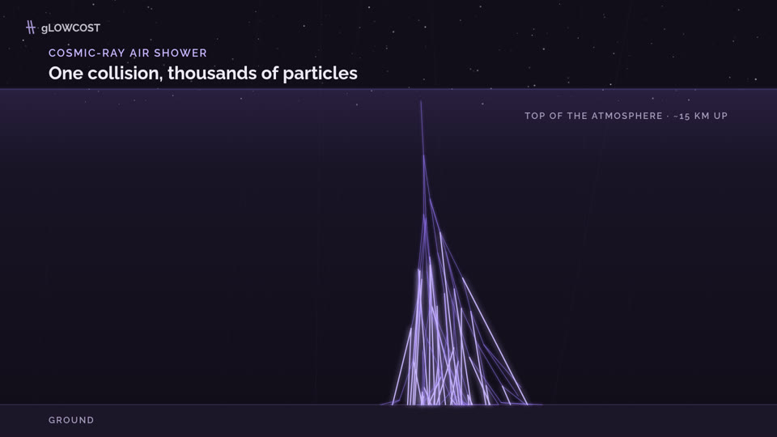
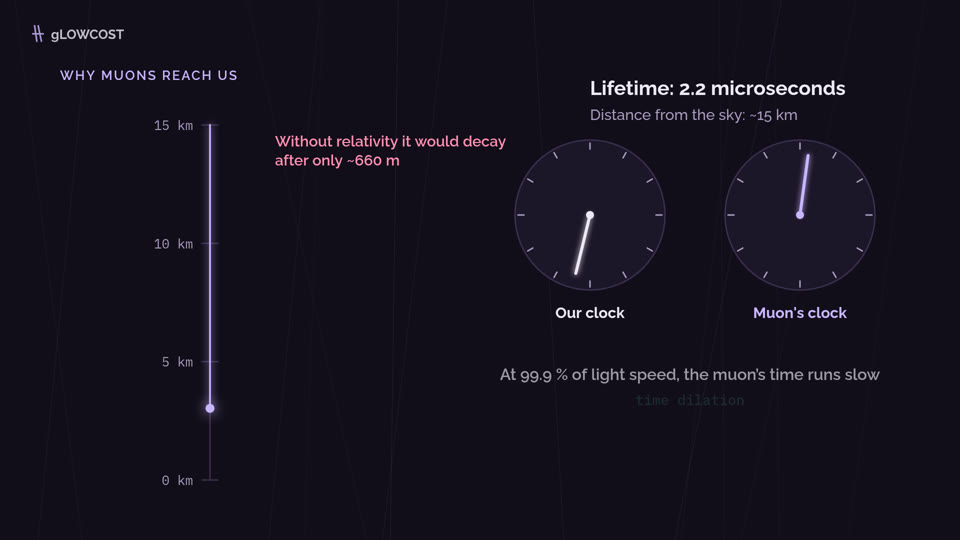
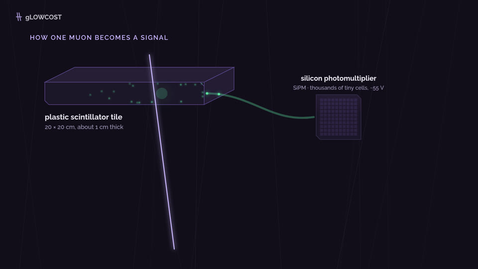
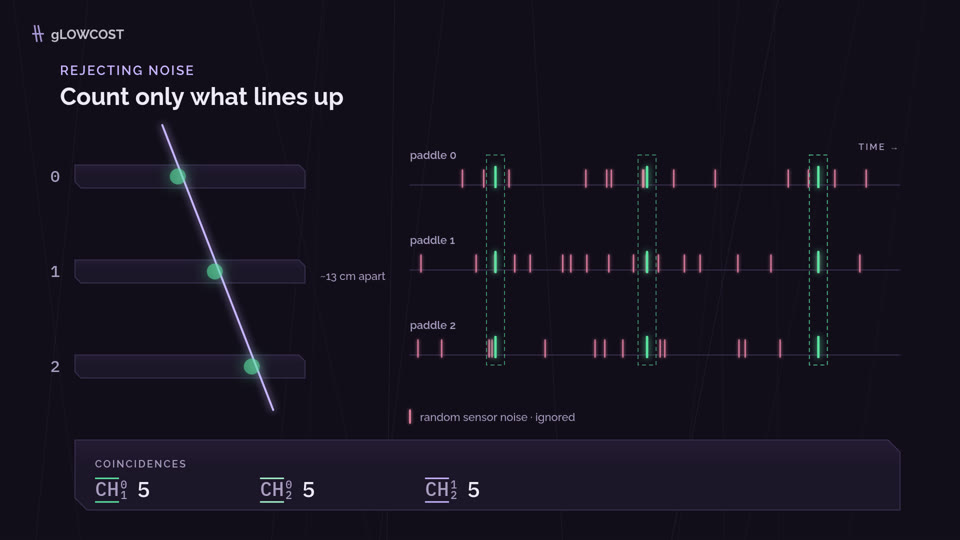
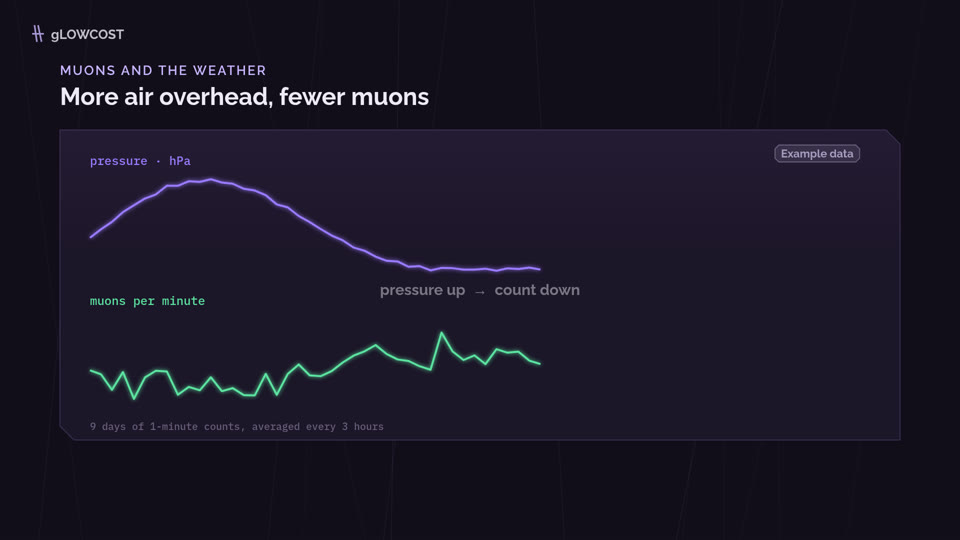
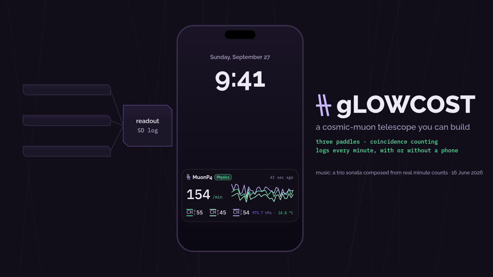

# gLOWCOST explainer

An 82-second explainer about the gLOWCOST cosmic-muon detector, for students and the general public.
- **Visuals:** every frame is drawn in code on an HTML canvas, in the style of the gLOWCOST iPhone app.
- **Music:** a trio sonata in the manner of Corelli, composed and synthesised in code, with its choices seeded by real detector minute counts (`data/muon_20260616_131649.csv`).
- **Narration:** eSpeak NG with the MBROLA `us1` female voice.

No footage, samples or paid services are used.

**▶ Watch:** [`media/gLOWCOST-explainer.mp4`](media/gLOWCOST-explainer.mp4) (1920×1080, 30 fps, 82 s). Closed captions: [`media/gLOWCOST-explainer.srt`](media/gLOWCOST-explainer.srt) (a separate file, not burned in).

<p>






</p>

To rebuild everything from source, see [Build](#build). To recreate the whole project from a single prompt, see [ONE_SHOT_PROMPT.md](ONE_SHOT_PROMPT.md).

## Story

| # | Scene | Physics |
|---|---|---|
| 1 | Sky | A cosmic-ray proton hits the upper atmosphere (~15 km) and makes an air shower; muons reach the ground. |
| 2 | Relativity | Muon lifetime 2.2 µs → ~660 m without relativity; time dilation lets them cross ~15 km. ≈1 muon / cm² / min at sea level. |
| 3 | Detection | Plastic scintillator → wavelength-shifting fibre → silicon photomultiplier (SiPM, ~55 V) → ~100× amplifier → threshold → digital hit. |
| 4 | Coincidence | SiPM dark counts are random; a hit only counts when two paddles fire within the FPGA's ±200 ns window. The outer pair sees fewer muons (smaller acceptance). |
| 5 | Weather | More air overhead absorbs more muons: about −0.15 % per hPa (provisional fit). **Simulated example data**, labelled on screen. |
| 6 | Close | Three paddles and a readout logging to SD on its own; a phone Lock Screen with the MuonP4 Live Activity, laid out like the app and animated on the real minute counts; then, in reading order, the title, subtitle, features and music credit. |

Hardware facts come from [gLOWCOST-2v2-mppcInterface-](https://github.com/tharinduudu/gLOWCOST-2v2-mppcInterface-) (`docs/DETECTOR_FUNCTIONALITY.md`, commit `677fb1b`) and the ESP32-P4 firmware. Deliberate limits: coincidence channels are not described as exclusive subsets, the HV command is never shown as a measured voltage, and the pressure coefficient is labelled provisional.

## Build

Requirements:
- Node 18+
- ffmpeg (or `pip install imageio-ffmpeg`)
- Chromium or Chrome (set `CHROME=/path/to/chrome` if Playwright cannot find one)
- `espeak-ng`, `mbrola` and `mbrola-us1` for the narration

```sh
npm install
node scripts/espeak-voice.js   # narration → audio/01-sky.wav … 06-close.wav
npm run render:preview   # quick 960×540, 15 fps check
npm run render           # final 1080p video + captions + music
npm run preview          # scrub the animation in a browser
```

Useful pieces:
- `node scripts/stills.js 5 16 38` — single frames to `build/stills/`.
- `node scripts/render.js --from 20 --to 32` — render a section.
- `npm run timeline` — scene start times and durations.

## Narration and timing

- **Voice:** eSpeak NG `mb-us1`, run at 165 wpm with no inserted word gaps. It is then slowed to 0.9× without changing pitch, and smoothed:
  - soxr resampling;
  - the buzz and sibilance softened;
  - gentle compression;
  - a small room.

  Settings: `--speed`, `--pitch` and `--tempo` in `scripts/espeak-voice.js`.
- **Scene length:** 0.7 s lead-in + clip + 1.0 s tail; the last scene holds an extra 1.8 s.
- **Sentence sync:** the pauses between sentences are detected in each clip, and each scene is time-warped so its visual beats (`anchors` in `src/script.json`) start as that sentence is spoken. After the last sentence the animation plays at normal speed.
- **Coincidence scene:** marked `realtime`. It plays at constant speed for the whole clip, so its scrolling timelines never visibly speed up.
- **Captions:** they follow the same sentence timings.
- **Mix:**
  - music bed at 0.25, side-chain ducked under the voice;
  - loudness-normalised to −16 LUFS;
  - AAC at 48 kHz.
- **Alternatives:** `scripts/klattsch-voice.mjs` (formant synthesis) and `scripts/voice.js` (ElevenLabs) remain.

## Other narration sources

Follow [ELEVENLABS.md](ELEVENLABS.md), or run `ELEVENLABS_API_KEY=… node scripts/voice.js --confirm`: six clips named `audio/01-sky.mp3` … `audio/06-close.mp3`, then `npm run render`. Each scene is re-timed to its clip (0.6 s lead-in, 0.7 s tail), the music ducks under the voice, the mix is loudness-normalised to −16 LUFS, and the captions are regenerated from the same timings. Scenes without a clip keep their default length.

## Layout

| Path | Purpose |
|---|---|
| `src/script.json` | Narration, ElevenLabs text, default scene lengths |
| `src/scenes.js` | All drawing: palette, app-style panels and CH labels, six scenes |
| `src/index.html` | Canvas page; open via `npm run preview` to scrub |
| `scripts/render.js` | Frame capture → H.264, audio mix; `--from/--to/--name` for sections |
| `scripts/espeak-voice.js` | Narration (eSpeak NG + MBROLA us1, smoothing chain) |
| `media/` | The rendered video, captions and stills |
| `ONE_SHOT_PROMPT.md` | A single prompt that reproduces this project |
| `scripts/music.js` | Trio sonata: two violins, cello and harpsichord continuo; data-seeded counterpoint with checks against parallel fifths/octaves |
| `scripts/voice.js` | ElevenLabs narration (dry run by default, `--confirm` to call the API) |
| `data/` | Real minute counts from 16 June 2026 used as the music seed |
| `scripts/captions.js` | SRT captions |
| `assets/fonts/` | Raleway and IBM Plex Mono (SIL Open Font License) |
| `audio/` | Your ElevenLabs clips (not generated) |

`build/` and `audio/` are ignored by git; everything in them is reproducible from source. `media/` holds the committed copy of the final render.
